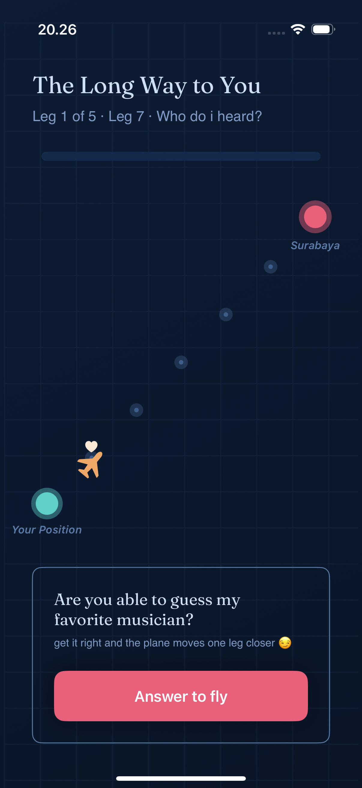
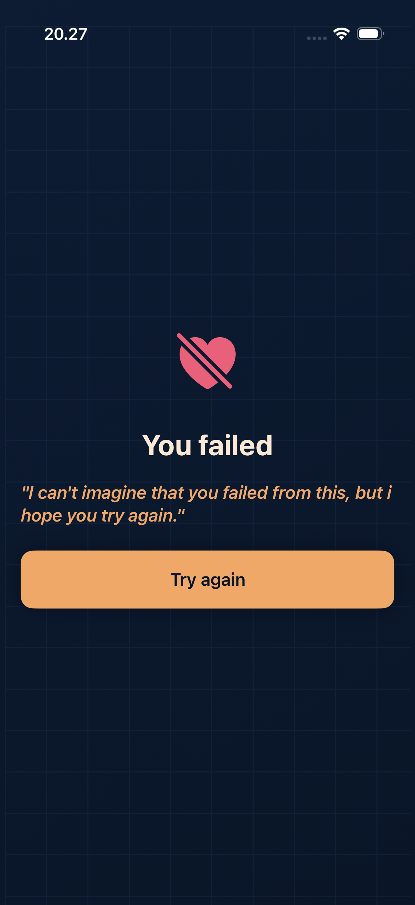
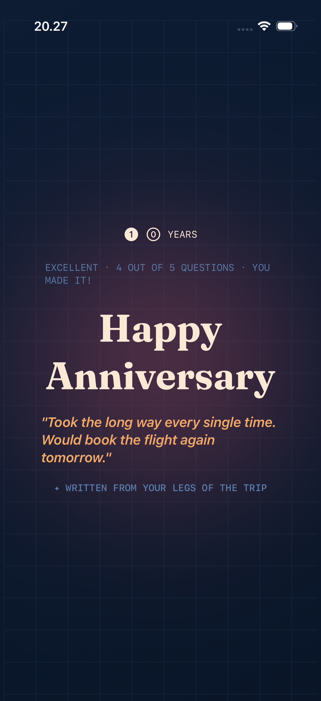

# 1607 · Long Way to Go

A personal anniversary app — not for the App Store, just for one person. Built as a love letter in code: answer 5 questions about us, get 4 right, and the plane lands. Fail, and you try again until you don't.

---

## How It Works

A plane travels across a flight map, one leg at a time. Each correct answer moves it closer to the destination. Answer 5 randomly picked questions from our story — get at least 4 right to unlock the anniversary message. Less than 4, and you're sent back to the gate.

---

## Features

- **Quiz with a heart** — 5 questions drawn randomly from a bank of 10, each one pulled from real moments, habits, and memories.
- **Multiple choice** — 3 options per question, no tricks. You either know it or you don't.
- **Flight map UI** — A plane moves leg by leg across the screen with every correct answer.
- **Pass condition** — 4 out of 5 correct to land. Anything less and the "Try Again" screen is waiting.
- **Anniversary reveal** — Pass the quiz and get a message that's been there since commit one.
- **Randomized every run** — Questions shuffle on launch so it stays fresh.

---

## Screenshots

| Home | Failed | Anniversary |
|:----:|:------:|:-----------:|
|  |  |  |

---

## Tech Stack

- **SwiftUI** — All UI, animations, and state management
- **Combine** — Reactive bindings between ViewModel and views

---

## The Date

**16/07** — that's what the name is about.
